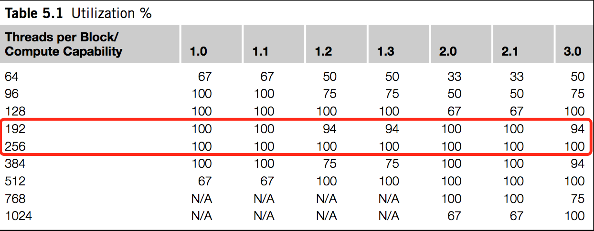

# CUDA 快速入门

## 了解

* CPU vs GPU ?

* CUDA ?
* CUDA vs OpenCL ?

## 开始

### 1) 并行

CPU:

```cpp
sth ...
// sum = lhs + rhs
for (size_t i = 0; i < n; ++i) {
  sum[i] = lhs[i] + rhs[i];
}
sth else ...
```

CUDA 做了什么？

CUDA 定义了内核函数（C语言的扩展），摘除了循环（直观）。

```cpp
// 内核函数语法
__global__ void kernel_func<<<num_blocks, num_threads>>>(param1, param2, ...)


// 写自己的内核函数（摘除循环）
__global__ void kernel_sum(lhs, rhs, sum) {
  const unsigned int i = (blockIdx.x * blockDim.x) + threadIdx.x;
  sum[i] = lhs[i] + rhs[i];
}

// 上述 CPU 循环代码，改调用内核函数
sth ...
kernel_sum<<<num_blocks, num_threads>>>(lhs, rhs, sum);
sth else ...
```

### 2) 线程块

num_blocks? num_threads?

* num_blocks: 线程块数量
* num_threads: 每个线程块里的线程数

总共有多少线程呢？ `num_blocks * num_threads`

举了例子：

```cpp
kernel_sum<<<2, 16>>>(lhs, rhs, sum);

// 线程块数？总线程数？
```

线程的意义？多少个线程，就多少个并行。上述例子有几个并行？

num_blocks, num_threads 有何用？

计算 i 这个索引。

```cpp
const unsigned int i = (blockIdx.x * blockDim.x) + threadIdx.x;
```

* blockIdx.x: 线程块的索引
* blockDim.x: 线程块上的线程总数
* threadIdx.x: 线程块上的线程索引

```cpp
kernel_sum<<<2, 16>>>(lhs, rhs, sum);

开了2个线程块，每个线程块16个线程，总共2x16=32个线程并行。

  线程块0  线程块1    << 想象：一长条的线程块
  [0-15]  [0-15]

并行时，kernel_sum 函数内获得的值：

  blockIdx.x 范围 [0-1]
  blockDim.x = 16
  threadIdx.x 范围 [0-15]
```

例如：计算 1024 大小的两数组和 `sum[1024] = lhs[1024] + rhs[1024]` 。每个线程计算一个加法，怎么做？

```cpp
// 注：num_blocks, num_threads 可以用变量，以便调优
size_t num_threads = 256;
size_t num_blocks = 1024 / 256 = 4;
kernel_sum<<<num_blocks, num_threads>>>(lhs, rhs, sum);

  block 0  block 1  block 2  block 3
  [0-255]  [0-255]  [0-255]  [0-255]

i = (blockIdx.x * blockDim.x) + threadIdx.x
  = (3 * 256) + 255 = 1023  // 最后一个线程块的最后一个线程，计算索引

目标：每个线程里取值`lhs[i],rhs[i],sum[i]`都能正确。
```

总述：内核函数规划了以多少线程并行（分几个线程块，每个多少线程）。每个并行的线程里，用内置变量 `blockIdx`, `threadIdx` 等，计算索引取值到你想要的值。

### 3) 内存交换

CPU GPU 内存不可互相访问，需要交换内存。

注： CPU, GPU 在 CUDA 里更准确的表述为 Host, Device 。当前仍沿用 CPU, GPU 的说法，但看到了 Host, Device 也能明白。

内存交换怎么做呢？

* GPU 分配内存
* CPU 内存数据拷贝到 GPU
* 内核函数用 GPU 内存里的数据进行计算
* GPU 内存数据拷贝到 CPU
* GPU 释放内存

```cpp
sth ...
{
  // 内存交换的字节数
  // 注：操作内存的大小以字节数表示
  size_t bytes = sizeof(int) * ARRAY_SIZE;

  // 声明 GPU 数据
  int *gpu_lhs;
  int *gpu_rhs;
  int *gpu_sum;

  // 分配 GPU 数据
  // __host__ ​__device__ ​cudaError_t cudaMalloc(void** devPtr, size_t size)
  // 注: __host__ 说明是主机函数，CPU 使用的； __device__ 说明是设备函数，GPU 使用的。

  cudaMalloc((void**)&gpu_lhs, bytes);
  cudaMalloc((void**)&gpu_rhs, bytes);
  cudaMalloc((void**)&gpu_sum, bytes);

  // 交换内存: cpu to gpu, host to device
  // __host__ ​cudaError_t cudaMemcpy(
  //     void* dst, const void* src, size_t count, cudaMemcpyKind kind)

  cudaMemcpy(gpu_lhs, lhs, bytes, cudaMemcpyHostToDevice);
  cudaMemcpy(gpu_rhs, rhs, bytes, cudaMemcpyHostToDevice);
  cudaMemcpy(gpu_sum, sum, bytes, cudaMemcpyHostToDevice);

  // 调用内核函数计算，用 GPU 数据
  // __global__ void kernel_func<<<blocks, threads_per_block>>>(...)

  kernel_sum<<<ARRAY_SIZE/64, 64>>>(gpu_lhs, gpu_rhs, gpu_sum);

  // 交换内存: gpu to cpu, device to host

  cudaMemcpy(lhs, gpu_lhs, bytes, cudaMemcpyDeviceToHost);
  cudaMemcpy(rhs, gpu_rhs, bytes, cudaMemcpyDeviceToHost);
  cudaMemcpy(sum, gpu_sum, bytes, cudaMemcpyDeviceToHost);

  // 释放 GPU 数据
  // __host__ ​__device__ ​cudaError_t cudaFree(void* devPtr)

  cudaFree(gpu_lhs);
  cudaFree(gpu_rhs);
  cudaFree(gpu_sum);
}
sth else ...
```

更详细的说明，见 [CUDA Memory Management](http://docs.nvidia.com/cuda/cuda-runtime-api/group__CUDART__MEMORY.html) 。

## 编译

用 [CUDA NVCC](http://docs.nvidia.com/cuda/cuda-compiler-driver-nvcc/index.html) 编译。或者，先用写好的 [cuda_go.mk](../../samples/cuda_go.mk) 开始吧。

项目里如何用起 GPU ：

提取要优化的 CPU 函数，用 GPU 实现并 NVCC 编译好库，再引入项目。

## 多维数据

内核函数 `<<<num_blocks, num_threads>>>` 的还可用 dim3 的数据结构：

```cpp
__global__ void kernel_func<<<dim3, dim3>>>(param1, param2, ...)
```

之前有一点先忽略了，计算索引时取的 x 。其表示的是在第一维度的值：

```cpp
i = (blockIdx.x * blockDim.x) + threadIdx.x
```

也有 y, z ，这时要用到 dim3 去声明线程块的结构。

二维的例子：

```cpp
// 线程块网格布局
// ┏━━━━━━━━━━━━━━━━━━━━━━━━━━━━━━━┳━━━━━━━━━━━━━━━━━━━━━━━━━━━━━━━┓
// ┃            ┆ threads(0-31, 0) ┃            ┆ threads(0-31, 0) ┃
// ┃ block(0,0) ┆ threads(0-31, 1) ┃ block(1,0) ┆ threads(0-31, 1) ┃
// ┃            ┆ threads(0-31, 2) ┃            ┆ threads(0-31, 2) ┃
// ┃            ┆ threads(0-31, 3) ┃            ┆ threads(0-31, 3) ┃
// ┣━━━━━━━━━━━━━━━━━━━━━━━━━━━━━━━╋━━━━━━━━━━━━━━━━━━━━━━━━━━━━━━━┫
// ┃            ┆ threads(0-31, 0) ┃            ┆ threads(0-31, 0) ┃
// ┃ block(0,1) ┆ threads(0-31, 1) ┃ block(1,1) ┆ threads(0-31, 1) ┃
// ┃            ┆ threads(0-31, 2) ┃            ┆ threads(0-31, 2) ┃
// ┃            ┆ threads(0-31, 3) ┃            ┆ threads(0-31, 3) ┃
// ┣━━━━━━━━━━━━━━━━━━━━━━━━━━━━━━━╋━━━━━━━━━━━━━━━━━━━━━━━━━━━━━━━┫
// ┃            ┆ threads(0-31, 0) ┃            ┆ threads(0-31, 0) ┃
// ┃ block(0,2) ┆ threads(0-31, 1) ┃ block(1,2) ┆ threads(0-31, 1) ┃
// ┃            ┆ threads(0-31, 2) ┃            ┆ threads(0-31, 2) ┃
// ┃            ┆ threads(0-31, 3) ┃            ┆ threads(0-31, 3) ┃
// ┣━━━━━━━━━━━━━━━━━━━━━━━━━━━━━━━╋━━━━━━━━━━━━━━━━━━━━━━━━━━━━━━━┫
// ┃            ┆ threads(0-31, 0) ┃            ┆ threads(0-31, 0) ┃
// ┃ block(0,3) ┆ threads(0-31, 1) ┃ block(1,3) ┆ threads(0-31, 1) ┃
// ┃            ┆ threads(0-31, 2) ┃            ┆ threads(0-31, 2) ┃
// ┃            ┆ threads(0-31, 3) ┃            ┆ threads(0-31, 3) ┃
// ┗━━━━━━━━━━━━━━━━━━━━━━━━━━━━━━━┻━━━━━━━━━━━━━━━━━━━━━━━━━━━━━━━┛

// 线程块总数： 2 * 4 = 8
// 线程块布局： 2 列 4 行 (X维度2，Y维度4)
const dim3 blocks_rect(2, 4);

// 每个线程块线程总数： 32 * 4 = 128
// 每个线程块线程布局： 32 列 4 行 (X维度32，Y维度4)
const dim3 threads_rect(32, 4);

// 总共并行的线程数为： 8 * 128 = 1024

// 一样使用内核函数
kernel_func<<<blocks_rect, threads_rect>>>(...);

// 但计算索引 x 时，y 要用起来了
idx = (blockIdx.x * blockDim.x) + threadIdx.x;
idy = (blockIdx.y * blockDim.y) + threadIdx.y;
tid = ((gridDim.x * blockDim.x) * idy) + idx;
```

* threadIdx.x: 于线程块，X维度上线程的索引
* threadIdx.y: 于线程块，Y维度上线程的索引
* blockIdx.x: 于线程网格，X维度上线程块的索引
* blockIdx.y: 于线程网格，Y维度上线程块的索引
* blockDim.x: 于线程块，X维度上线程的总数
* blockDim.y: 于线程块，Y维度上线程的总数
* gridDim.x: 于线程网格，X维度上线程块的总数
* gridDim.y: 于线程网格，Y维度上线程块的总数

```cpp
idx = (blockIdx.x * blockDim.x) + threadIdx.x;
idy = (blockIdx.y * blockDim.y) + threadIdx.y;
tid = ((gridDim.x * blockDim.x) * idy) + idx;

// 最后一个线程块的最后一个线程，计算索引
idx = (1 * 32) + 31             // 线程于整体X维度上的索引
idy = (3 * 4) + 3               // 线程于整体Y维度上的索引
tid = ((2 * 32) * idy) + idx    // X维度上的总线程数 * idy + idx ，二维算成一维上的索引
    = 1023
```

* [MatMul Sample](http://docs.nvidia.com/cuda/cuda-c-programming-guide/#shared-memory)

## 其他补充

### 线程数

```cpp
__global__ void kernel_func<<<num_blocks, num_threads>>>(param1, param2, ...)
```

num_threads 选择 256 ，并行次数为 3 的倍数时，可考虑 192 。



### CUDA 耗时

See [Events](http://docs.nvidia.com/cuda/cuda-c-programming-guide/#events).
